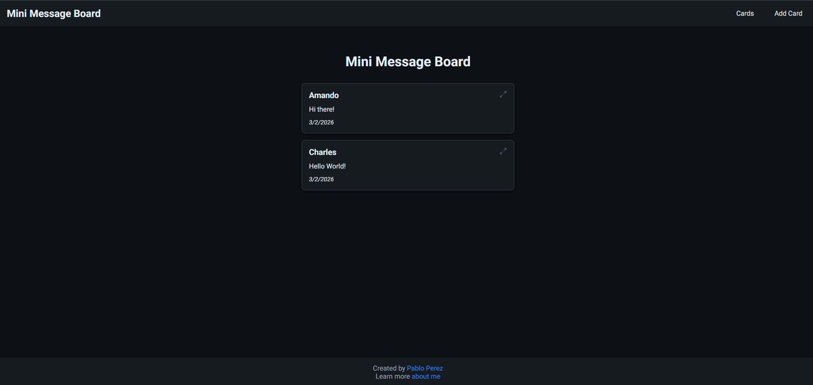
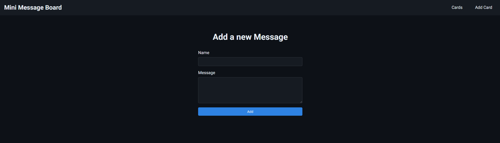
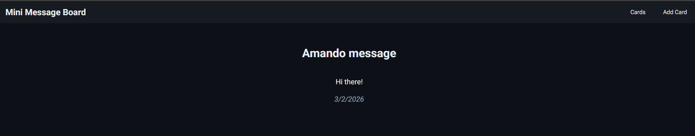

# TOP Mini Message Board

A simple message board built with Express and EJS where users can post messages and open individual message cards.

## Live Demo

- [View Live Page](https://mini-message-board-xpfr.onrender.com)

Note: This app is hosted on Render free tier. It may take ~30 seconds or more to wake up.

## Tech Stack

- Node.js
- Express
- EJS
- CSS

## Getting Started

1. Install dependencies:
   ```bash
   npm install
   ```
2. Start the server:
   ```bash
   npm start
   ```
3. Open your browser at:
   ```
   http://localhost:3000
   ```

## Features

- View all messages on the home page
- Add a new message through the form
- Open each message in a dedicated card view

## Course

This project is part of The Odin Project curriculum:
- [Node.js Mini Message Board Lesson](https://www.theodinproject.com/lessons/node-path-nodejs-mini-message-board)

## Screenshots







## Project Links

- GitHub Profile: https://github.com/yaoming16
- Personal Page: https://yaoming16.github.io/

## Repository

- https://github.com/yaoming16/TOP-Mini-Message-Board
